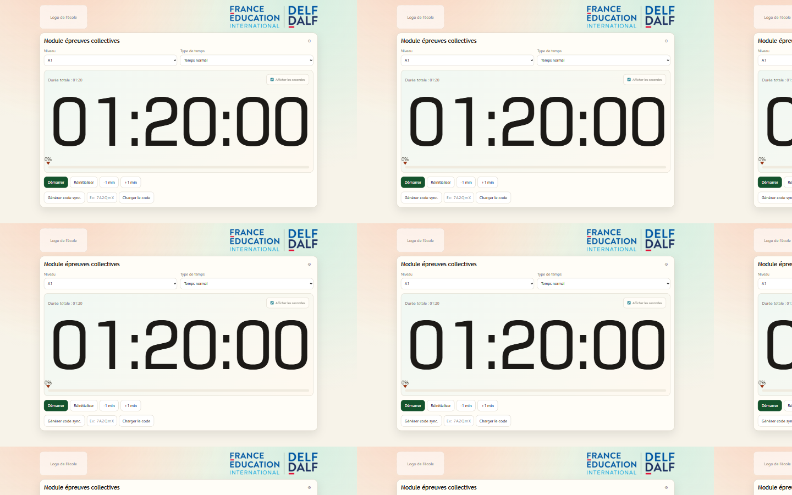
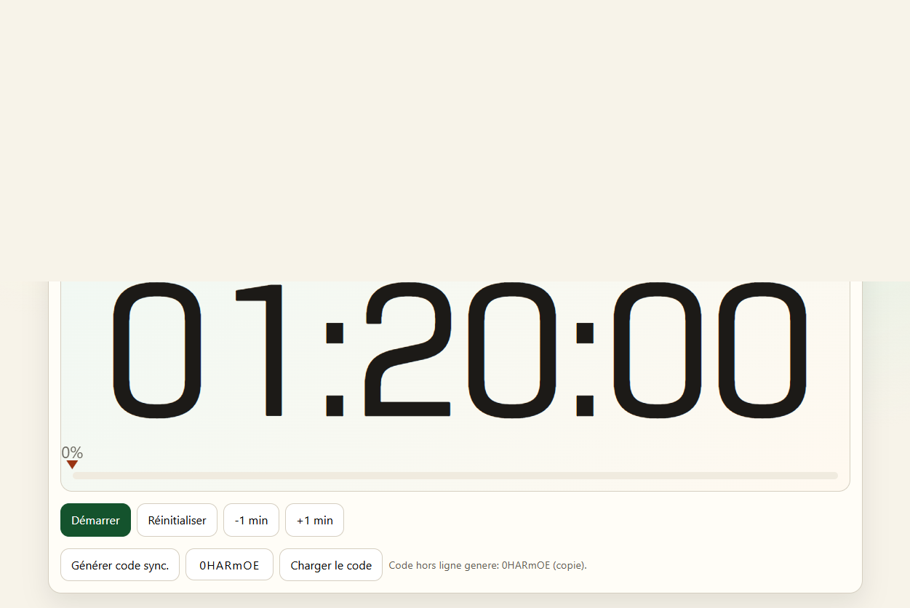
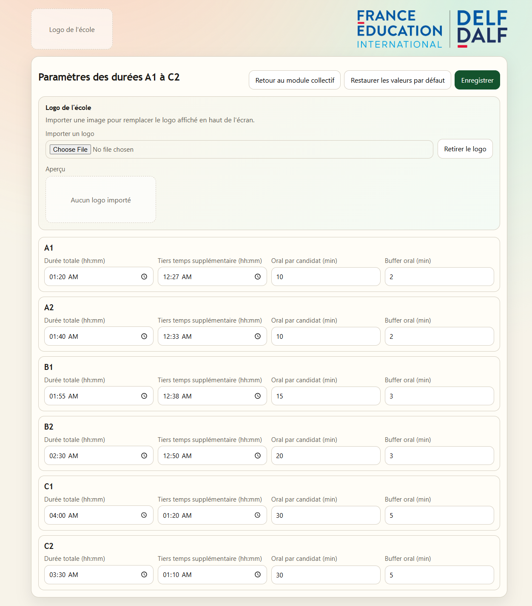

# Manuel d'utilisation rapide - Horloge DELF DALF

Version courte et intuitive (objectif : moins de 3 pages)

## 1. À quoi sert l'application

Horloge DELF DALF permet de gérer le chronométrage des épreuves collectives (A1 à C2), avec :
- temps normal ou tiers temps;
- affichage optionnel des secondes ;
- pause, reprise, ajout/retrait de minutes;
- transfert hors ligne du chrono via un code court;
- personnalisation des durées par niveau.

Les réglages sont enregistrés automatiquement sur le poste (pas besoin de reconfigurer à chaque ouverture).

## 2. Démarrage (le plus simple)

### Option A - Version déjà installée
1. Ouvrez l'application Horloge DELF DALF.
2. L'écran principal affiche directement le module des épreuves collectives.

### Option B - Depuis le projet (mode desktop)
1. Ouvrez un terminal dans le dossier du projet.
2. Lancez:

```bash
npm install
npm run desktop
```

## 3. Utiliser le module épreuves collectives

### Étape 1 - Choisir le niveau et le type de temps
1. Choisissez le niveau (A1, A2, B1, B2, C1 ou C2).
2. Choisissez le type de temps:
- Temps normal
- Tiers temps

La durée totale s'ajuste automatiquement selon vos paramètres.

### Étape 2 - Lancer le chrono
1. Cliquez sur le bouton de démarrage/reprise.
2. Le decompte commence immediatement.

### Étape 3 - Pendant l'épreuve
- Pause : met le chrono en attente sans perdre le temps restant.
- Reprise : relance depuis le temps restant.
- +1 min / -1 min (ou équivalent) : ajuste rapidement la fin d'épreuve.
- Afficher les secondes : active/désactive l'affichage précis.

### Étape 4 - Réinitialiser
- Utilisez Réinitialiser pour revenir à la durée du niveau sélectionné.
- Le chrono actif est effacé.



## 4. Transfert hors ligne du chrono (code court)

Utile si vous devez reporter un chrono sur un autre poste, sans réseau.

### Exporter un code
1. Sur le poste source, générez un code hors ligne.
2. Le code apparaît (et peut être copié automatiquement).

### Importer un code
1. Sur le poste cible, saisissez ce code.
2. Importez.
3. Le chrono se recale automatiquement :
- en cours (reprend),
- en pause,
- ou déjà terminé selon le temps écoulé.

Conseil : importez le code dès que possible pour minimiser l'écart temporel.



## 5. Modifier les paramètres (icône engrenage)

1. Cliquez sur l'icône engrenage dans le module collectif.
2. Pour chaque niveau (A1 à C2), réglez :
- Durée totale
- Tiers temps supplémentaire
- Durée oral par candidat
- Buffer oral
3. Cliquez sur Enregistrer.
4. Option possible : Restaurer les valeurs par défaut.

## 6. Logo de votre établissement

Dans les paramètres, vous pouvez :
- importer un logo (bmp, jpg, jpeg, png, svg, tif, tiff) pour remplacer le placeholder;
- retirer le logo si nécessaire.

Le logo est mémorisé localement.



## 7. Bonnes pratiques le jour J

- Faites un test de chrono 5 minutes avant l'arrivée des candidats.
- Vérifiez le niveau et le mode (normal/tiers temps) avant de lancer.
- Gardez un poste de secours et utilisez le code hors ligne en cas de besoin.
- Évitez de vider le cache navigateur ou le stockage local pendant la session.

## 8. Dépannage express

- Le chrono ne repart pas comme prévu :
  vérifiez si vous êtes en pause ou si la session est arrivée à 0.
- Les réglages semblent perdus :
  testez sur le même navigateur/profil utilisateur (stockage local).
- Le logo ne s'affiche pas :
  réimportez un format image autorisé.

---

Besoin d'une version ultra-courte 1 page (mémo salle d'examen) ?
Vous pouvez réduire ce document aux sections 3, 4 et 7.
